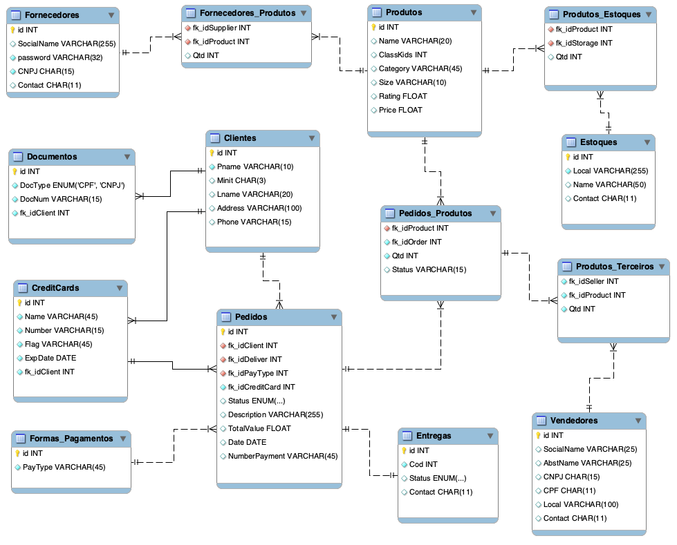

## Index
* [About](#ancora1)
* [Technologies](#ancora2)
* [EER](#ancora3)
* [Scripts_BD](#ancora4)

## 💭 About

This is a repository for publish my project at the bootcamp of iFood - Data Science, this repository contains a simple BD project

## 🧪 Technologies

This project was developed using the following technologies:

- [MySQL](https://www.mysql.com/)
- [Python](https://www.python.org/)

## 📊 EER

## 📝 SQL Commands

- [Table Creation](assets/criandoTabelaSQL.sql)
- [Table Storage](assets/povoandoTabelas.sql)

Made with 💜 by [Felipe Cabral](https://github.com/FCabral07)👋